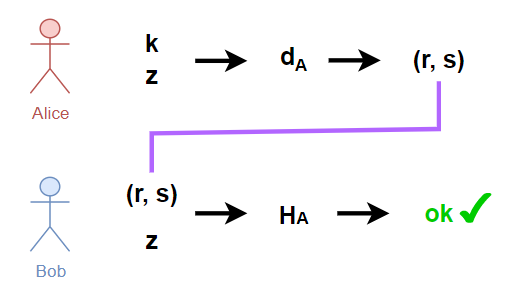
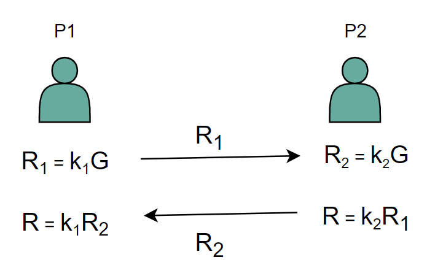
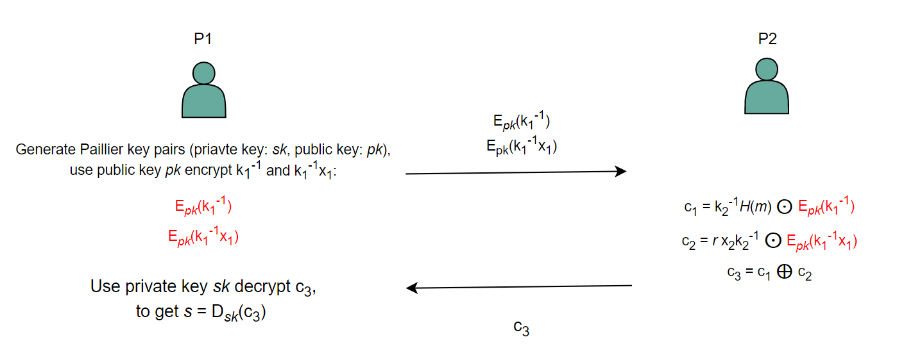
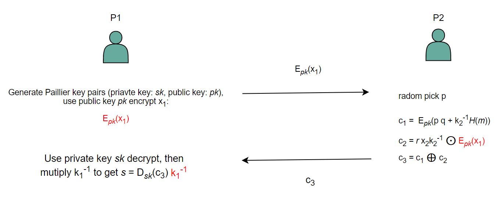
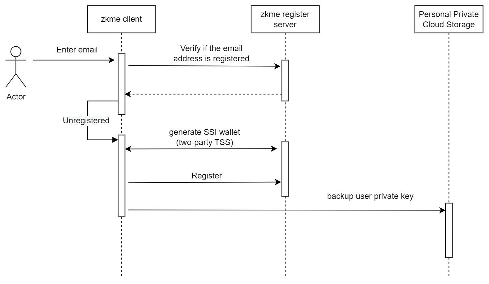
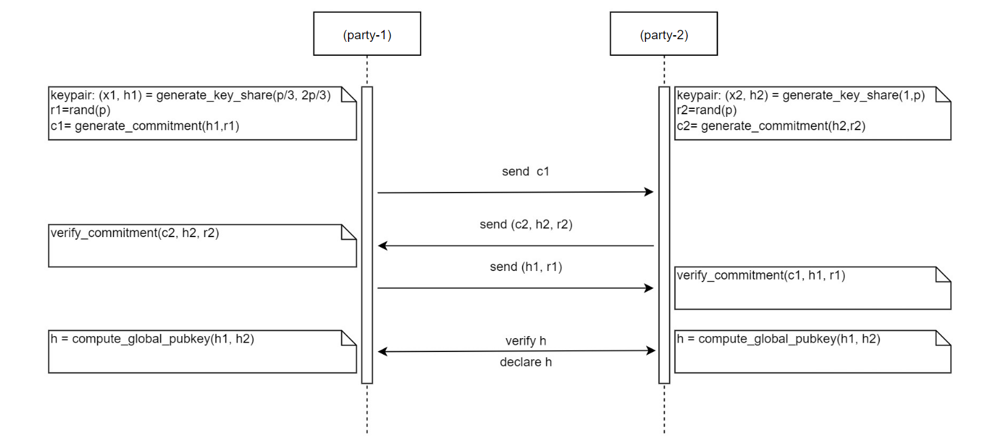
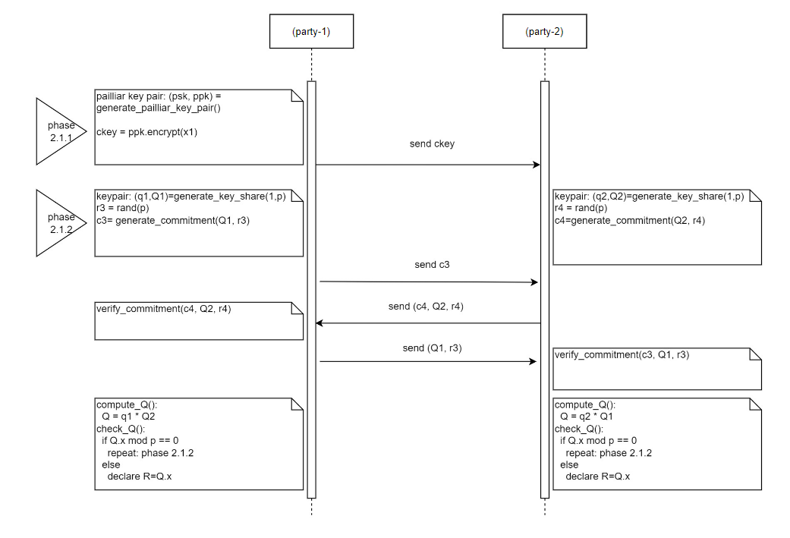
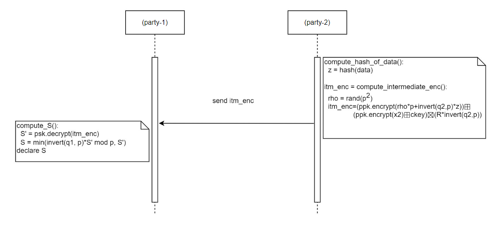

# Elliptic Curve Digital Signature Algorithm (ECDSA) Demo
This is a two-party ECDSA demo.

## Digital Signature Algorithm
The **Digital Signature Algorithm (DSA)** is a public key cryptosystem and federal information processing standard for digital signatures based on the mathematical concept of modular exponentiation and the discrete logarithm problem. DSA is a variant of the Schnorr and ElGamal signature scheme.

## Elliptic Curve Digital Signature Algorithm

**ECDSA** is a variant of the DSA algorithm and makes use of **elliptic curve cryptography** for the simulation of DSA. In contrast to ordinary discrete logarithm and large integer decomposition problems, elliptic curve cryptography has a higher strength per bit than other public-key cryptographic regimes because the elliptic curve is currently the only public key cryptography that cannot be broken using sub-exponential algorithms.

## Signing with ECDSA

Scenario:

Alice wants to sign a message with her private key ($d_A$), and Bob wants to validate the signature using Alices's public key ($H_A$). No one should be able to generate a valid signature except Alice. Everyone should be able to check signatures.

  

ECDSA actually works on the hash of the message, rather than on the message itself. The hash of the message should be truncated so that the bit length of the hash is the same as the bit length of $n$ (the order of the subgroup). The truncated hash is an integer that will be represented as $z$.

  

The ECDSA signing algorithm is defined as follows:

  

1. Take a random integer $k$ from $\{1, \dots, n - 1\}$

2. Calculate the origin point $P = kG$

3. Calculate the number $r = x_P \bmod{n}$

4. If $r = 0$, then choose another random $k$

5. Calculate $s = k^{-1} (z + rd_A) \bmod{n}$

6. If $s = 0$, then choose another $k$ and try again

  

The pair $(r, s)$ is the signature

## Verifying signatures

In order to verify the signature we’ll need Alice’s public key $H_A$, the (truncated) hash $z$ and, obviously, the signature $(r, s)$.

  

1. Calculate the integer $u_1 = s^{-1} z \bmod{n}$.

2. Calculate the integer $u_2 = s^{-1} r \bmod{n}$.

3. Calculate the point $P = u_1 G + u_2 H_A$.

  

The signature is valid only if $r = x_P \bmod{n}$.

## Two-party generation ECDSA
In 2001, MacKenzie and Reiter proposed a two-party ECDSA Signing scheme.

MacKenzie and Reiter propose the following idea: participant $P_1$ randomly generates $x_1, k_1$ (as in standard ECDSA, where $x_1$ is to be saved and $k_1$ is to be used one at a time), and similarly participant $P_2$ randomly generates $x_2, k_2$, the $k$ and $x$ of the population formed by these two parties are obtained by $k=k_1 \cdot k_2$ and $x = x_1 \cdot x_2$, respectively. MacKenzie and Reiter give a scheme for constructing the signature data of the group private key to a message without each party revealing its own secret (i.e. $x_i, k_i$).  

#### Group's public key
Before describing how to construct the group signature data, let's describe how to get the group's public key $Q = x \cdot G = x_1 \cdot x_2 \cdot G$. We can use the **_Diffie-Hellman key exchange_** method to get $Q$ without each party revealing their secret value $x_i$.  $P_1$ sends $Q_1 = x_1 \cdot G$ to $P_2$ then $P_2$ takes $Q_1$ and multiplies it by $x_2$ to get the group public key; $P_1$ can also get the group public key $Q$ by a similar process.
 
 #### Group signature data $r$ part
From ECDSA, we know that the group signature data $r$ is the x-axis coordinate of $R = k1 \cdot k2 \cdot G$, and we only need to find the group $R$ to know $r$. Similar to calculating the group public key $Q$, using **_Diffie-Hellman key exchange_** methods then $P1, P2$ can both obtain the group $R$.

#### Group signature data $s$ part
$s$ in standard ECDSA:
$s=k^{-1} \cdot (H(m) + r \cdot x) \bmod q$

After switching to two-party signatures, the calculation of $s$ is adjusted accordingly to:
$s=(k_1 \cdot k_2)^{-1} \cdot (H(m) + r \cdot x_1 \cdot x_2) \bmod q$

To ensure that $P1 does$ not leak $x1,k1$ and $P2$ does not leak $x2,k2$ to compute the $s$ part of the signature data, we can use the **_Paillier cryptosyste_**

In the above equation, the red part is known only to $P_1$, $P_1$ encrypts it and sends it to $P_2$, who uses the homomorphic encryption property of Paillier to construct the encrypted s on the ciphertext then sends it to $P_1$, $P_1$ decrypts it to get $s$, the process is shown in the figure below.
 
In the following figure, we denote the homomorphic addition as $\oplus$, and the homomorphic multiplication as $\odot$.
 

#### Cons of _MacKenzie-Reiter_ solutions
In order to prevent malicious participants, the two-party ECDSA protocol needs to ensure that the final generated group signature is correct. $P_1$ needs to prove that the encrypted data it provides to $P_2$ actually contains $k_1^{-1}$ without revealing $k_1$, which is done with the help of "zero-knowledge proof". Since $P_2$ only has $R_1=K_1 \cdot G$ (which does not contain $K_1^{-1} \cdot G$), the proof process is very complicated and involves many operations, which is costly.  

#### _Yehuda Lindell_ Solution
In 2017, _Yuhuda Lindell_ proposed a faster two-party ECDSA solution. 
The method of constructing the group public key and group signature data $r$ part in _Yehuda Lindell_ solution is similar to the _MacKenzie-Reiter_ scheme, but the part of constructing the group signature data $s$ part is optimized.

$\begin{aligned} s &=(k_1 \cdot k_2)^{-1} \cdot (H(m) + r \cdot x_1 \cdot x_2) \bmod q \\
&= \left( k_2^{-1} \cdot H(m) + r \cdot x_2 \cdot k_2^{-1} \cdot {\color{red}{x_1}} \right) {\color{red}{k_1^{-1}}} \bmod q
\end{aligned}$

The random number $p$ is added to this process for better security, and since it is always multiplied by the modulus $q$, it does not affect the correctness.

## zkMe User Registery Flowchart

Two-party ECDSA scheme: additive key share type two-party computed signature
The global private key is: $x = x_1 + x_2 \mod p$
The global public key is: $h = x * P$
Pros: The key share could be refreshed

#### Symbols in code and comments
| Symbol  | Notion  | Symbol  | Notion  |
| :---: | :---: | :---: | :---: |
| $P$  | The base point of the elliptic curve  | $x$ | Global private key (no one knows it) (type: scalar) |
| $p$  | The order of the base point  | $h$ | Global public key (type: ecpoint) |
| $Z_n$  | The order of the base point  | $x_i$ | party-i 's private key (key share of $x$) (type: scalar) |
| +  | Numerical addition  | $h_i$ | party-i 's public key (key share of $h$) (type: ecpoint) |
| *  | Numerical multiplication  | $c_i$ | party-i 's commiment (type: scalar) |
| $\oplus$  | Elliptic curve point addition operation  | $r_i$ | Random number (type: scalar) |
| $\otimes$  | Elliptic curve multiplier operation  | $q_i$ | party-i 's private share of $q$ (type: scalar) |
| $⊞$  | Paillier addition (the addition can be plaintext or ciphertext encrypted with the same homomorphic public key)  | $Q_i$ | party-i 's share of $Q$ (type: ecpoint) (if its x-coordinate does not equal 0, $R=Q$) |
| $⊠$  | Paillier multiplication (multiplier can only be plaintext)  | $R$ | First party of signature (type: scalar) |
| $H$  | keccak256  | $S$ | Second party of signature (type: scalar) |

#### Phase 1 Negotiate the global public key $h$, the SSI wallet address
step1: Generate a keypair $(x_1,h_1)$ about the $h$ of party-1 and make a commitment $c_1$ ($c_1=H(h_1,r_1)$). Generate a keypair $(x_2,h_2)$ about the $h$ of party-2 and commitment $c_2$ ($c_2=H(h_2,r_2)$).

| Function  | Math operation  |
| :---: | :---: |
|generate_key_share(m, n) at party-i|$x_i \stackrel{R}{\longleftarrow} [m,n], h_i = x_i \otimes P$|
|rand(p) at party-i|$r \stackrel{R}{\longleftarrow} [1,p]$|
|generate_commitment(m, n) at party-i|$c = H(m \|\| n)$|
|verify_commitment(c, m, n) at party-i|$c' = H(m \|\| n)$, check $c==c'$|

step2: party-1 sends $c_1$ to party-2

step3: party-2 sends $c_2$ and the preimage of $c_2 (h_2, r_2)$  to party-1

step4: party-1 verify $c_2 = H(h_2, r_2)$, and then send the preimage of $c_1 (h_1, r_1)$ to party-2

step5: party-2 verify $c_1 = H(h_1, r1)$

step6: party-1 and party-2 compute $h=h_1+h_2$, confirm the same result, and declare the global public key as $h$

| Function  | Math operation  |
| :---: | :---: |
|compute_global_pubkey(m,n) at party-i|$h=m \oplus n$|

#### Phase 2 Signing
##### Phase 2.1 Consensus random number $R$
##### Phase 2.1.1
party-1 generates the Paillier keypair $(psk,ppk)$ and encrypts party-1's private key $x_1$ : $c_{key} = ppk.encrypt(x_1)$ with the Paillier public key and sends $c_{key}$ to party-2
##### Phase 2.1.2
step1: Generate a keypair $(q_1,Q_1)$ about the $Q$ of party-1 and make a commitment $c_3 = H(Q_1,r_3)$ to $Q_1$. Generate a keypair $(q_2,Q_2)$ about the $Q$ of party-2 and make a commitment ($c_4=H(Q_2,r_4)$ to $Q _2$.

step2: party-1 sends $c_3$ to party_2

step3: party-2 sends $c_4$ and the preimage $c_4$ ($Q_2, r_4$) to party-1

step4: party-1 verify $c_4 = H(Q_2, r_4)$, and then send the preimage of $c_3$ ($Q1, r_3$) to party-2

step5: party-2 verify $c_3 = H(Q_1, r3)$

step6: party-1 computes $Q = q_1 * Q2$, party-2 computes $Q = q_2 * Q1$. After both parties confirm that the horizontal coordinate $mod p$ of $Q$ is not zero and the results are the same, they both declare $R = Q.x$, otherwise re-run Phase 2.1.2

| Function  | Math operation  |
| :---: | :---: |
|compute_Q() at party-i|$Q =q_i \otimes Q_{3-i}$|
|check_Q() at party-i|$Q \cdot x == 0$?   Ture: repeat phase 2.1.2   False: declare $R = Q \cdot x$|

#### Phase 2.2 Co-signing $S$
step1: party-2 computes the hash digest of the data $z$, and computes the intermediate ciphertext itm_enc based on the ckey obtained from Phase 2.1.1, and its own private key $x_2$, and finally party-2 sends the itm_enc to party-1

| Function  | Math operation  |
| :---: | :---: |
|compute_intermediate_enc() at party-2|$\rho \stackrel{R}{\longleftarrow} [1,p^2]$,  $q_2^{-1} = invert(q_2,p)$,   $tmp= \rho \times p + ((q_2^{-1} \times z) \bmod  p)$,   $enc_1 = ppk.encrypt(tmp)$,  $enc_2 = ppk.encrypt(x_2)$,   $enc_3 = c_{key} ⊞ enc_2$,  $enc_4 = (R*q_2^{-1}) ⊠ enc_3$,   $enc_5= enc_1 ⊞ enc_4$,  itm_enc = $enc_5$ |

step2: party-2 sends iem_enc to party-1, party-1 computes the second part of the signature $S$ and finally declares $S$

| Function  | Math operation  |
| :---: | :---: |
|compute_S() at party-1|$S' = psk.decrypt(c_5)$,$q_1^{-1} = invert(q_1,p)$   $S'' = q_1^{-1} \times S' \bmod p$, $S = min(S'', p-S'')$|

